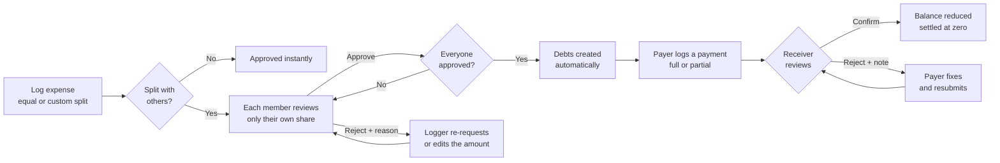
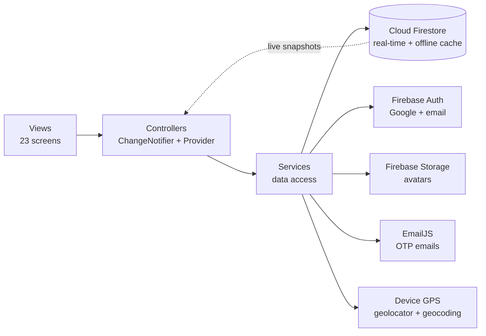

<div align="center">


# Taka Koi?

### Split trip expenses with friends. No spreadsheets. No mental math. No awkward conversations.

*"Taka Koi?" means "Where's the money?" in Bengali* 😄

[](https://github.com/Crux-15/Taka-Koi-/releases/latest/download/Taka-Koi.apk)


[The story](#-the-story) · [Features](#-features) · [How it works](#-how-it-works) · [Architecture](#-architecture) · [Install](#-install-on-android) · [Build from source](#-build-from-source) · [Roadmap](#-roadmap)

</div>

---

## 📖 The story

On a trip in the hills, we hit a problem every group knows. Someone paid for transport, someone paid for food, someone paid for the stay, and by the end nobody remembered who paid what.

A spreadsheet is not something you open on a hillside. And even when you do write everything down, you still have to calculate it all by hand, with plenty of room for miscalculation and misremembering.

So I built **Taka Koi?**: log an expense the moment it happens, let the app do the math, and let every friend confirm their own share so there are no surprises at the end of the trip.

It works offline, because trips don't promise good signal.

<!--
SCREENSHOTS (add before publishing, then delete this comment wrapper)
1. Create a folder: docs/screenshots/
2. Save 4 to 6 phone screenshots there (suggested: home, log-expense, approval, debts, group-hub, dark-mode)
3. Uncomment the block below

## 📸 Screenshots

| Home | Log expense | Approve a share | Debts |
|:---:|:---:|:---:|:---:|
|  |  |  |  |
-->

---

## ✨ Features

### 👥 Tour groups
- Create a tour, pick its currency (BDT, USD, EUR, GBP, INR, PKR, MYR or AED) and invite friends with a **6-character code**
- Join codes **expire after 1 hour** and the admin can refresh them, so a leaked code doesn't stay valid
- Members join instantly with the code
- Admin tools: remove members who have no approved expenses, transfer admin rights, end the tour
- Members can request to leave, and the admin approves
- Tours **end automatically after 4 days of inactivity**
- Tour history with a per-member spending breakdown for every past tour

### 💸 Expenses
- Log an amount and a note, with **GPS location and a readable address** captured automatically
- **Equal split** or **custom split**, with an option to include or exclude yourself and a live split preview
- **Consent-based approval:** every member reviews and approves only their own share
- Rejected a share? Add a reason, and the logger can re-request it or (for custom splits) adjust the amount and ask again
- Deleting an expense is direct for the admin, and a request for everyone else
- Home feed with a live member ranking by total spent

### 🏦 Debts and settlement
- Debts are created automatically once an expense is fully approved
- **I owe** and **Owed to me** tabs with a **net balance per person**
- Pay in full or **in parts**, and the app blocks amounts above what is still owed
- The person being paid **confirms or rejects** each payment (with a note), and the payer can fix and resubmit
- A debt closes automatically when its balance reaches zero

### 📲 bKash number sharing
- Ask a member for their bKash number inside the app
- If they haven't added one, they are prompted to add it
- Once they accept, the number appears with a **one-tap copy** button
- Numbers stay hidden unless someone explicitly shares them

> The app tracks and confirms who paid whom. The money itself moves through bKash or cash, outside the app.

### 🔔 Notifications
- Real-time in-app notifications for every action: approvals, rejections, payments, join and leave events, bKash requests
- Tap a notification to jump straight to the item that needs your decision
- Unread badge on the navigation bar

### 🔐 Accounts and experience
- **Google Sign-In**, or email registration with a **6-digit OTP**, password setup and profile photo upload
- Forgot-password flow via Firebase
- Light and dark themes (remembered between launches)
- Offline banner that tells you changes will sync when you're back online

---

## 🔄 How it works

The core idea is **nothing becomes a debt until the right person says yes**.



---

## 🏗️ Architecture

Clean **MVC** with a dedicated service layer, so UI, state and data access stay separate.



### Project structure

```
lib/
├── main.dart              # Firebase init, offline persistence, providers, theme
├── controllers/           # State and business logic
│   ├── auth_controller.dart
│   ├── group_controller.dart
│   ├── expense_controller.dart
│   ├── debt_controller.dart
│   ├── notification_controller.dart
│   └── theme_controller.dart
├── models/                # User, Group, Expense, Debt, Payment, Notification
├── services/              # Firestore, Auth, Storage, EmailJS and GPS access
├── utils/                 # GoRouter config, theme, colors, constants
├── views/                 # Screens, grouped by feature
│   ├── auth/  splash/  group/  expenses/
│   └── debts/  notifications/  profile/  shell/
└── widgets/common/        # Reusable components (buttons, avatars, banners)
```

### Firestore data model

```
users/{uid}
groups/{groupId}                 # members are stored as a map on the group
 ├── expenses/{expenseId}        # splits, per-member approvals, rejection reasons
 ├── debts/{debtId}              # original and remaining amount, status
 ├── payments/{paymentId}        # pending, approved or rejected
 ├── auditLog/{logId}            # SHA-256 hashed event records
 └── leaveRequests/{uid}
notifications/{notificationId}
bkashRequests/{requestId}
```

### Engineering decisions

| Decision | Why |
|---|---|
| **Firestore offline persistence with an unlimited cache** | Logging works with no signal, and writes sync automatically when the connection returns |
| **Batched writes for approvals and settlement** | Debt creation and balance updates are atomic, so a debt is never half-created |
| **Single-field queries with client-side filtering and sorting** | No composite indexes to deploy, so the project sets up with fewer steps |
| **Per-member approval map on each expense** | Each person decides only on their own share, and the expense finalizes when all are approved |
| **Expiring join codes** | A shared code stops working after an hour unless the admin refreshes it |
| **Audit log with SHA-256 payload hashes** | Expense events leave a verifiable trail |
| **Stream-driven controllers** | Firestore snapshots feed `ChangeNotifier`s, so every screen updates live |

---

## 🛠️ Tech stack

| Layer | Technology |
|---|---|
| Framework | Flutter and Dart |
| State management | Provider (`ChangeNotifier`) |
| Navigation | GoRouter with auth and active-group guards |
| Database | Cloud Firestore (real-time, offline-enabled) |
| Authentication | Firebase Auth (Google Sign-In, email and password) |
| File storage | Firebase Storage (profile photos) |
| OTP email | EmailJS REST API |
| Location | `geolocator`, `geocoding` |
| Connectivity | `connectivity_plus` |
| Utilities | `crypto`, `uuid`, `intl`, `shared_preferences`, `image_picker`, `cached_network_image` |
| Architecture | MVC with a service layer |

About **11.6K lines of Dart** across 23 screens, 6 controllers, 7 services and 6 models.

---

## 📲 Install on Android

No Play Store needed. Install the APK directly:

1. On your Android phone, open **[⬇️ Taka-Koi.apk](https://github.com/Crux-15/Taka-Koi-/releases/latest/download/Taka-Koi.apk)**
2. If asked, allow installs from your browser
3. Tap the downloaded file, then **Install**
4. Open **Taka Koi?** and sign in 🎉

> If you see "Install blocked", go to **Settings → Security → Install unknown apps** and allow your browser.

The app asks for location (to tag expenses), camera and photos (for your profile picture) and internet access.

---

## 🧪 Build from source

> The source is public for review. Under the [proprietary license](LICENSE), running or reusing it beyond the released APK needs the author's written permission.

**Prerequisites**
- Flutter stable (the committed `pubspec.lock` was resolved with Dart 3.12, so use a recent release)
- Android Studio or VS Code
- A Firebase project with **Firestore**, **Authentication** (Google and Email/Password) and **Storage** enabled
- [FlutterFire CLI](https://firebase.flutter.dev/docs/cli): `dart pub global activate flutterfire_cli`
- An [EmailJS](https://www.emailjs.com) account for OTP emails

**Setup**

```bash
git clone https://github.com/Crux-15/Taka-Koi-.git
cd Taka-Koi-
flutter pub get
```

1. **Connect Firebase.** Run `flutterfire configure` and choose your project and the Android package `com.tourtracker.tour_expense_tracker`. This generates `lib/firebase_options.dart` and `android/app/google-services.json`. Both are git-ignored, so every clone must generate its own.
2. **Enable Google Sign-In.** Add your debug SHA-1 fingerprint to the Firebase Android app.
3. **Configure OTP email.** Create an EmailJS service and a template that uses the variables `to_name`, `to_email` and `otp_code`, then put your IDs in `lib/services/email_service.dart`.
4. **Run it:**

```bash
flutter run
```

**Release build**

```bash
flutter build apk --release
```

---

## 🔒 Security notes

- Firebase config files, signing keys and `.env` files are excluded from version control
- Join codes expire, bKash numbers are consent-only, and approvals follow explicit rules (members approve their own shares, receivers confirm payments, admins approve deletions and leave requests)
- Firestore security rules are **not included in this repository**. Deploy rules that mirror the permission model above before any production use

---

## 🗺️ Roadmap

- [ ] Push notifications through Firebase Cloud Messaging (currently in-app only)
- [ ] Debt simplification across the whole group to minimize the number of transfers
- [ ] Server-side OTP verification (currently handled in the app via EmailJS)
- [ ] Firestore security rules with automated rule tests
- [ ] Unit and integration tests for split and settlement logic
- [ ] Expense categories and trip summary charts
- [ ] iOS build and a Play Store release

---

## 👨‍💻 Author

**Sadman Sakib**, final-year CSE student at American International University-Bangladesh (AIUB)

[](https://github.com/Crux-15)
[](https://linkedin.com/in/sadmaan-sakib)

## 📄 License

**Proprietary software.** Copyright © 2025 Sadman Sakib. All rights reserved.
You may download and use the APK for personal, non-commercial purposes. Copying, modifying or redistributing the source code is not permitted without written permission. See [LICENSE](LICENSE) for details.

---

<div align="center">

Made with 💛 for friends who travel together

</div><div align="center">

<h1>💛 Taka Koi?</h1>

<p><strong>"Taka Koi?"</strong> means <em>"Where's the money?"</em> in Bengali.</p>

<p>A smart, real-time <strong>group expense tracker</strong> built for friends on trips & tours.<br/>
Split bills, track who owes who, and settle up — without the awkward conversations.</p>


<br/><br/>

<a href="https://github.com/Crux-15/Taka-Koi-/releases/latest/download/Taka-Koi.apk">
  
</a>

</div>

---

## 📲 Install on Android

> **No Play Store needed** — just download and install directly!

1. On your Android phone, open this link: **[⬇️ Download Taka Koi?.apk](https://github.com/Crux-15/Taka-Koi-/releases/latest/download/Taka-Koi.apk)**
2. If asked *"Allow from this source"* → tap **Allow**
3. Tap the downloaded file → tap **Install**
4. Done! Open **Taka Koi?** and sign in 🎉

> **Note:** If you see *"Install blocked"*, go to your phone's **Settings → Security → Install unknown apps** and allow your browser.

---

## ✨ Features

### 👥 Group Management
- Create a trip group and share a **6-character invite code** with friends
- Admin approval for join requests
- Real-time member list with expense rankings
- Request to leave group (admin approval required)
- Group history — view all past tours

### 💸 Expense Tracking
- Log expenses with amount, description & GPS location capture
- **Equal split** or **custom split** per member
- Admin approval workflow for all submitted expenses
- Members can request deletion — admin approves or rejects
- Full expense history with filters

### 🏦 Debt Settlement
- Automatically calculates **who owes who** after expenses
- "I Owe" and "Owed to Me" tabs
- Log payments with proof — admin approves
- Net debt calculation to simplify complex group balances

### 🔔 Smart Notifications
- In-app real-time notifications for every action
- Tappable notifications — tap to review, approve, or act
- Unread badge count on the notification tab

### 📲 bKash Integration
- Request a member's bKash number privately
- Member receives notification — Accept or Decline
- Once accepted, number shows with a **one-tap copy** button
- Number stays hidden from others unless explicitly shared

### 🔐 Authentication
- **Google Sign-In**
- **Email + OTP verification** → Password setup
- Profile photo upload (Firebase Storage)
- bKash number in profile

---

## 🛠️ Tech Stack

| Layer | Technology |
|---|---|
| **Framework** | Flutter 3.x (Dart) |
| **State Management** | Provider |
| **Navigation** | GoRouter |
| **Backend** | Firebase Firestore (real-time) |
| **Auth** | Firebase Auth (Google + Email/Password) |
| **Storage** | Firebase Storage (avatars) |
| **Architecture** | MVC (Model–View–Controller) |

---

## 📁 Project Structure

```
lib/
├── controllers/     # Business logic (Auth, Group, Expense, Debt, Notification)
├── models/          # Data models (User, Group, Expense, Debt, Payment, Notification)
├── services/        # Firebase service layer
├── utils/           # Constants, theme, colors, router
├── views/           # UI screens
│   ├── auth/        # Login, Register, OTP, Profile Setup
│   ├── expenses/    # Home, Log Expense, History, Detail
│   ├── debts/       # Debt Overview, Log Payment, Payment Review
│   ├── group/       # Group Hub, Create, Join, Admin Dashboard
│   ├── notifications/
│   └── profile/
└── widgets/         # Reusable UI components
```

---

## 🚀 Getting Started

### Prerequisites
- Flutter SDK `>=3.0.0`
- Firebase project (Firestore, Auth, Storage enabled)
- Android Studio / VS Code

### Setup

1. **Clone the repository**
   ```bash
   git clone https://github.com/Crux-15/Taka-Koi-.git
   cd Taka-Koi-
   ```

2. **Install dependencies**
   ```bash
   flutter pub get
   ```

3. **Add your Firebase config**
   - Create a Firebase project at [console.firebase.google.com](https://console.firebase.google.com)
   - Add an Android app and download `google-services.json`
   - Place it in `android/app/google-services.json`
   - Enable **Firestore**, **Authentication** (Google + Email/Password), and **Storage**

4. **Run the app**
   ```bash
   flutter run
   ```

---

## 🔒 Security Notes

- `google-services.json` is excluded from version control (`.gitignore`)
- All expense and payment approvals require admin authorization
- bKash numbers are hidden by default — only revealed after explicit consent
- Firestore security rules should be configured before production deployment

---

## 📸 App Flow

```
Splash → Login / Register (OTP)
      → Group Hub (no active group)
            → Create Group  OR  Join with code
      → Home (active group)
            → Log Expense → Admin Approves → Debts Auto-calculated
            → Debt Tab → Log Payment → Admin Approves → Settled
            → Notifications → Tap to Review / Approve / Act
            → Profile → Edit info, bKash number, leave group
```

---

## 👨‍💻 Author

**Sadman Sakib**
- GitHub: [@Crux-15](https://github.com/Crux-15)

---

## 📄 License

This project is **proprietary software**. The source code is protected — you may **not** copy, modify, or redistribute it. You may only use the app by downloading the APK. See the [LICENSE](LICENSE) file for full details.

---

<div align="center">
<p>Made with 💛 for friends who travel together</p>
</div>
